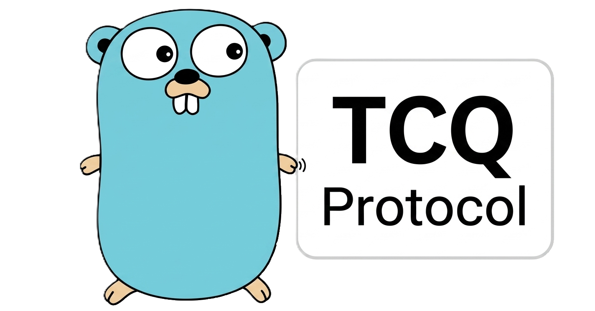

  

# HTTP/3

This package implements HTTP/3 ([RFC 9114](https://datatracker.ietf.org/doc/html/rfc9114)), including QPACK ([RFC 9204](https://datatracker.ietf.org/doc/html/rfc9204)) and HTTP Datagrams ([RFC 9297](https://datatracker.ietf.org/doc/html/rfc9297)).
It aims to provide feature parity with the standard library's HTTP/1.1 and HTTP/2 implementation.

Detailed documentation can be found on [quic-go.net](https://quic-go.net/docs/).
